# WhatsApp Bridge - Complete Flow Documentation

> Node.js WhatsApp client that bridges natural language queries to the FastAPI backend, enabling GitHub repository automation via WhatsApp messages.

---

## Table of Contents

1. [System Overview](#1-system-overview)
2. [Architecture & Components](#2-architecture--components)
3. [Message Lifecycle](#3-message-lifecycle)
4. [Setup Flow](#4-setup-flow)
5. [Command Processing](#5-command-processing)
6. [Query Processing Pipeline](#6-query-processing-pipeline)
7. [Response Formatting](#7-response-formatting)
8. [State Management](#8-state-management)
9. [Error Handling](#9-error-handling)

---

## 1. System Overview

### Purpose

The WhatsApp Bridge acts as a **gateway between WhatsApp users and the AI Engineering Backend**, enabling:
- User credential setup (GitHub token, Anthropic key)
- Natural language query processing
- GitHub repository status queries
- Project switching & multi-user support
- Real-time response formatting optimized for WhatsApp

### Key Features

| Feature | Purpose |
|---------|---------|
| **Per-user Sessions** | Maintains state per phone number |
| **4-Step Setup Flow** | GitHub token → Owner → Repo → Anthropic key |
| **Command System** | !setup, !status, !graph, !help, !technical, etc. |
| **Project Switching** | Change repo mid-conversation naturally |
| **Query Intent Parsing** | Classifies user intent via backend LLM |
| **Response Formatting** | Optimizes output for WhatsApp (markdown → text) |
| **Conversation History** | Tracks user/bot exchanges for context |
| **Graph Integration** | Triggers knowledge graph builds |
| **Rate Limiting & Validation** | Token/repo verification before use |

---

## 2. Architecture & Components

### 2.1 Component Diagram

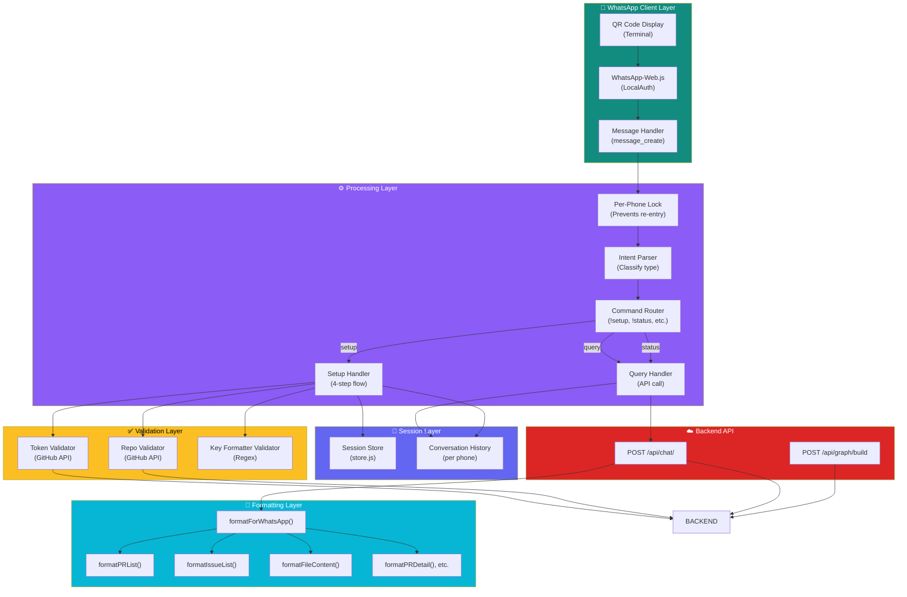

### 2.2 File Organization

```
whatsapp-bridge/
├── index.js                         # Main client + message handler
│   ├── Client initialization        # WhatsApp-Web.js setup
│   ├── message_create handler       # Event listener
│   ├── Setup flow                   # 4-step configuration
│   ├── Command router               # !setup, !status, etc.
│   ├── Query processing             # API calls to backend
│   └── Response formatters          # WhatsApp-optimized output
│
├── store.js                         # Session persistence
│   ├── getSession(phone)           # Retrieve user state
│   ├── saveSession(phone)          # Persist user state
│   ├── addHistory(phone, role, content)  # Add conversation
│   ├── getHistory(phone)           # Retrieve conversation
│   └── isReady(session)            # Check if setup complete
│
├── package.json                     # Dependencies
│   ├── whatsapp-web.js             # WhatsApp client
│   ├── axios                        # HTTP client
│   ├── dotenv                       # Environment variables
│   └── qrcode-terminal              # QR code display
│
└── .wwebjs_auth/                   # WhatsApp auth session (gitignored)
    └── [browser profiles]           # Session data
```

### 2.3 Data Flow Overview

```mermaid
graph LR
    A["📱 WhatsApp<br/>User Message"]
    B["🔐 Lock &<br/>Validate"]
    C["🤖 Parse<br/>Intent"]
    D["📋 Route<br/>Command"]
    E["⚙️ Process<br/>Setup/Query"]
    F["✅ Validate<br/>Data"]
    G["☁️ Call<br/>Backend API"]
    H["📝 Format<br/>Response"]
    I["📤 Send<br/>Reply"]

    A --> B
    B --> C
    C --> D
    D --> E
    E --> F
    F --> G
    G --> H
    H --> I

    style A fill:#128c7e,color:#fff
    style B fill:#dc2626,color:#fff
    style C fill:#8b5cf6,color:#fff
    style D fill:#7c3aed,color:#fff
    style E fill:#06b6d4,color:#fff
    style F fill:#fbbf24,color:#000
    style G fill:#ef4444,color:#fff
    style H fill:#10b981,color:#fff
    style I fill:#34d399,color:#000
```

---

## 3. Message Lifecycle

### 3.1 Complete Message Flow

```mermaid
sequenceDiagram
    participant User as 👤 User
    participant WA as WhatsApp Client
    participant Handler as Message Handler
    participant Lock as Processing Lock
    participant Session as Session Store
    participant Validator as Validators
    participant Backend as Backend API
    participant Formatter as Formatters
    participant Reply as Reply Sender

    User->>WA: Send message
    WA->>Handler: Trigger message_create
    
    Handler->>Handler: Extract phone #<br/>Check if fromMe
    Handler->>Handler: Check if group/status
    
    alt Not from user
        Handler->>User: Ignore
    else Valid user message
        Handler->>Lock: Check phone lock
        alt Already processing
            Handler->>User: Skip (locked)
        else Lock acquired
            Lock->>Session: getSession(phone)
            Session-->>Session: Load state/history
            
            alt Setup incomplete
                Session->>Handler: Not ready
                Handler->>Validator: Run setup step
                Validator-->>Handler: Prompt/validate
                Handler->>Session: saveSession()
                Handler->>Reply: Send setup message
            else Setup complete
                Session->>Handler: Ready
                Handler->>Backend: POST /api/chat/
                Backend->>Backend: Process query
                Backend-->>Handler: Response + intent
                Handler->>Formatter: formatForWhatsApp()
                Formatter-->>Handler: Formatted text
                Handler->>Session: addHistory()
                Handler->>Reply: Send formatted reply
            end
            
            Lock->>Lock: Release lock
        end
    end
    
    Reply->>User: Display message

    style User fill:#128c7e,color:#fff
    style WA fill:#128c7e,color:#fff
    style Handler fill:#8b5cf6,color:#fff
    style Lock fill:#dc2626,color:#fff
    style Session fill:#6366f1,color:#fff
    style Validator fill:#fbbf24,color:#000
    style Backend fill:#ef4444,color:#fff
    style Formatter fill:#10b981,color:#fff
    style Reply fill:#34d399,color:#000
```

### 3.2 Message Type Detection & Routing

```mermaid
graph TD
    START["Receive message<br/>from user"]
    
    CHECK1{"Is 'fromMe'?<br/>(bot's own reply)"}
    CHECK2{"Is group msg<br/>or status?"}
    CHECK3{"Is text empty?"}
    CHECK4{"Already<br/>processing<br/>this phone?"}
    
    IGNORE1["❌ Ignore<br/>(self-message)"]
    IGNORE2["❌ Ignore<br/>(group/status)"]
    IGNORE3["❌ Ignore<br/>(empty)"]
    IGNORE4["❌ Skip<br/>(locked)"]
    
    ACQUIRE["🔒 Acquire lock<br/>for phone"]
    EXTRACT["📝 Extract phone #<br/>Load session"]
    DETECT["🔍 Detect msg type"]
    
    TYPE1{"Command?<br/>(!setup, !status)"}
    TYPE2{"Setup step?<br/>(incomplete)"}
    TYPE3{"Project change?<br/>(!repo, switch to)"}
    TYPE4{"Anthropic key?<br/>(sk-ant-)"}
    TYPE5{"Query?<br/>(natural language)"}
    
    CMD["⚙️ Handle command"]
    SETUP["📋 Run setup step"]
    PROJ["🔄 Update project"}
    KEY["🔑 Save API key"]
    QUERY["🤖 Process query<br/>→ backend API"]
    
    SEND["📤 Send response"]
    RELEASE["🔓 Release lock"]
    
    START --> CHECK1
    CHECK1 -->|yes| IGNORE1
    CHECK1 -->|no| CHECK2
    CHECK2 -->|yes| IGNORE2
    CHECK2 -->|no| CHECK3
    CHECK3 -->|yes| IGNORE3
    CHECK3 -->|no| CHECK4
    CHECK4 -->|yes| IGNORE4
    CHECK4 -->|no| ACQUIRE
    
    ACQUIRE --> EXTRACT
    EXTRACT --> DETECT
    DETECT --> TYPE1
    TYPE1 -->|yes| CMD
    TYPE1 -->|no| TYPE2
    TYPE2 -->|yes| SETUP
    TYPE2 -->|no| TYPE3
    TYPE3 -->|yes| PROJ
    TYPE3 -->|no| TYPE4
    TYPE4 -->|yes| KEY
    TYPE4 -->|no| TYPE5
    TYPE5 -->|yes| QUERY
    
    CMD --> SEND
    SETUP --> SEND
    PROJ --> SEND
    KEY --> SEND
    QUERY --> SEND
    SEND --> RELEASE
    
    style START fill:#128c7e,color:#fff
    style ACQUIRE fill:#dc2626,color:#fff
    style EXTRACT fill:#8b5cf6,color:#fff
    style DETECT fill:#7c3aed,color:#fff
    style CMD fill:#06b6d4,color:#fff
    style SETUP fill:#fbbf24,color:#000
    style PROJ fill:#a78bfa,color:#fff
    style KEY fill:#34d399,color:#000
    style QUERY fill:#f59e0b,color:#000
    style SEND fill:#10b981,color:#fff
    style RELEASE fill:#34d399,color:#000
```

---

## 4. Setup Flow

### 4.1 Setup State Machine

```mermaid
stateDiagram-v2
    [*] --> new: User sends !setup
    
    new --> setup_token: Prompt for GitHub token
    setup_token --> token_validate: User sends token
    token_validate --> token_error: Invalid token
    token_error --> setup_token: Re-prompt
    token_validate --> setup_owner: ✅ Token valid
    
    setup_owner --> owner_input: Prompt for owner
    owner_input --> setup_repo: User sends owner
    
    setup_repo --> repo_validate: User sends repo
    repo_validate --> repo_error: Repo not found
    repo_error --> setup_repo: Re-prompt
    repo_validate --> setup_anthropic: ✅ Repo valid
    
    setup_anthropic --> anthropic_input: Prompt for key
    anthropic_input --> key_skip: User sends 'skip'
    anthropic_input --> key_validate: User sends key
    key_validate --> key_error: Invalid format
    key_error --> setup_anthropic: Re-prompt
    
    key_skip --> ready: ✅ Setup complete
    key_validate --> ready: ✅ Key saved
    
    ready --> [*]: User can now query
    
    note right of setup_token
        State: setup_token
        Waiting for: GitHub PAT
        Validation: Token format + GitHub API test
    end
    
    note right of setup_owner
        State: setup_owner
        Waiting for: GitHub owner/org
        Validation: None (used in next step)
    end
    
    note right of setup_repo
        State: setup_repo
        Waiting for: Repository name
        Validation: GitHub API check
    end
    
    note right of setup_anthropic
        State: setup_anthropic
        Waiting for: API key or 'skip'
        Validation: Regex format check
    end
    
    note right of ready
        State: ready
        All credentials set
        Ready to process queries
    end
```

### 4.2 Setup Step Flow Diagram

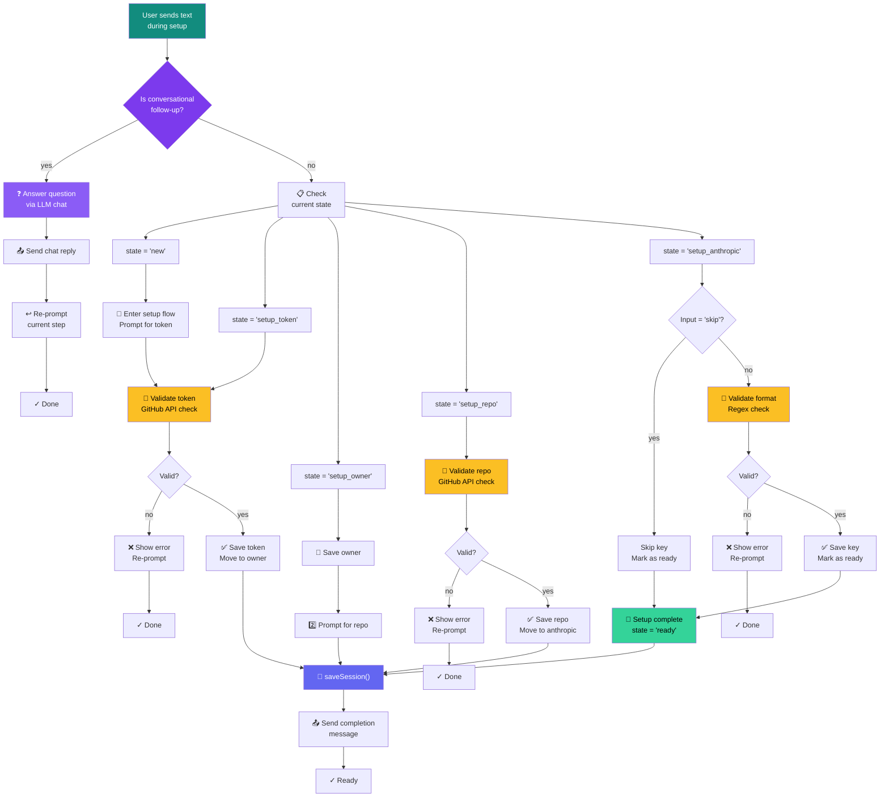

---

## 5. Command Processing

### 5.1 Command Router

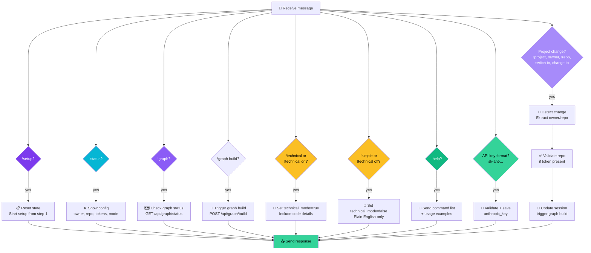

### 5.2 Supported Commands Reference

```mermaid
graph TB
    CMDS["🎮 Command List"]
    
    SETUP["!setup"]
    STATUS["!status"]
    HELP["!help"]
    GRAPH["!graph"]
    GRAPH_BUILD["!graph build"]
    TECHNICAL["!technical / !technical on"]
    SIMPLE["!simple / !technical off"]
    
    KEY["!key sk-ant-xxx"]
    OWNER["!owner name"]
    REPO["!repo name"]
    PROJECT["!project owner/repo"]
    
    SETUP_DESC["Reset & start 4-step setup"]
    STATUS_DESC["Show current config"]
    HELP_DESC["List all commands"]
    GRAPH_DESC["Show graph stats"]
    GRAPH_BUILD_DESC["Trigger graph rebuild"]
    TECHNICAL_DESC["Switch to technical mode"]
    SIMPLE_DESC["Switch to simple mode"]
    
    KEY_DESC["Update Anthropic key"]
    OWNER_DESC["Change GitHub owner/org"]
    REPO_DESC["Change repository"]
    PROJECT_DESC["Change owner + repo together"]
    
    CMDS --> SETUP
    CMDS --> STATUS
    CMDS --> HELP
    CMDS --> GRAPH
    CMDS --> GRAPH_BUILD
    CMDS --> TECHNICAL
    CMDS --> SIMPLE
    CMDS --> KEY
    CMDS --> OWNER
    CMDS --> REPO
    CMDS --> PROJECT
    
    SETUP --> SETUP_DESC
    STATUS --> STATUS_DESC
    HELP --> HELP_DESC
    GRAPH --> GRAPH_DESC
    GRAPH_BUILD --> GRAPH_BUILD_DESC
    TECHNICAL --> TECHNICAL_DESC
    SIMPLE --> SIMPLE_DESC
    KEY --> KEY_DESC
    OWNER --> OWNER_DESC
    REPO --> REPO_DESC
    PROJECT --> PROJECT_DESC
    
    style CMDS fill:#7c3aed,color:#fff
    style SETUP fill:#06b6d4,color:#fff
    style STATUS fill:#06b6d4,color:#fff
    style HELP fill:#06b6d4,color:#fff
    style GRAPH fill:#8b5cf6,color:#fff
    style GRAPH_BUILD fill:#8b5cf6,color:#fff
    style TECHNICAL fill:#fbbf24,color:#000
    style SIMPLE fill:#fbbf24,color:#000
    style KEY fill:#34d399,color:#000
    style OWNER fill:#34d399,color:#000
    style REPO fill:#34d399,color:#000
    style PROJECT fill:#34d399,color:#000
```

---

## 6. Query Processing Pipeline

### 6.1 Query Processing Flow

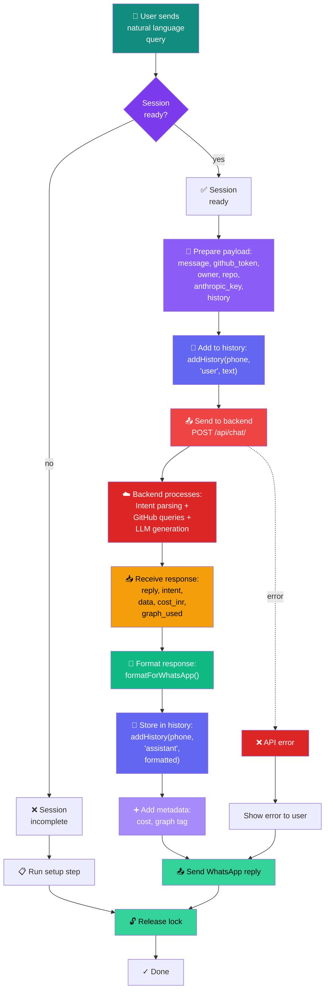

### 6.2 Backend API Call Details

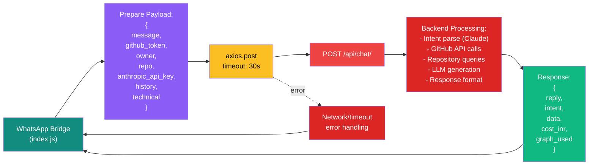

---

## 7. Response Formatting

### 7.1 Formatting Pipeline

```mermaid
graph TD
    RAW_RESPONSE["📥 Raw API response<br/>{ reply, intent, data }"]
    
    FMT_CHECK{"data.type<br/>specified?"}
    
    NO_TYPE["Use fallback<br/>return reply as-is"]
    
    HAS_TYPE["Route by type"]
    
    TYPE_PR_LIST["type:<br/>pr_list"]
    TYPE_ISSUE_LIST["type:<br/>issue_list"]
    TYPE_COMMIT_LIST["type:<br/>commit_list"]
    TYPE_PR_DETAIL["type:<br/>pr_detail"]
    TYPE_COMMIT_DETAIL["type:<br/>commit_detail"]
    TYPE_ISSUE_DETAIL["type:<br/>issue_detail"]
    TYPE_REPO_INFO["type:<br/>repo_info"]
    TYPE_DIRECTORY["type:<br/>directory"]
    TYPE_FILE_CONTENT["type:<br/>file_content"]
    TYPE_COUNT["type:<br/>count"]
    
    FMT_PR_LIST["formatPRList(data)<br/>List open PRs<br/>with links"]
    FMT_ISSUE_LIST["formatIssueList(data)<br/>List open issues<br/>with links"]
    FMT_COMMIT_LIST["formatCommitList(data)<br/>List recent commits<br/>with SHAs"]
    FMT_PR_DETAIL["formatPRDetail(data)<br/>PR details:<br/>status, author,<br/>description"]
    FMT_COMMIT_DETAIL["formatCommitDetail(data)<br/>Commit details:<br/>files, additions,<br/>deletions"]
    FMT_ISSUE_DETAIL["formatIssueDetail(data)<br/>Issue details:<br/>status, labels,<br/>comments"]
    FMT_REPO_INFO["formatRepoInfo(data)<br/>Repo metadata:<br/>stars, language,<br/>description"]
    FMT_DIRECTORY["formatDirectory(data)<br/>List files in dir<br/>with sizes"]
    FMT_FILE_CONTENT["formatFileContent(data)<br/>File preview<br/>with syntax highlighting"]
    FMT_COUNT["Return count<br/>+ label"]
    
    FORMATTED["✅ Formatted<br/>WhatsApp-safe<br/>text"]
    
    RAW_RESPONSE --> FMT_CHECK
    
    FMT_CHECK -->|no| NO_TYPE
    FMT_CHECK -->|yes| HAS_TYPE
    
    NO_TYPE --> FORMATTED
    
    HAS_TYPE --> TYPE_PR_LIST
    HAS_TYPE --> TYPE_ISSUE_LIST
    HAS_TYPE --> TYPE_COMMIT_LIST
    HAS_TYPE --> TYPE_PR_DETAIL
    HAS_TYPE --> TYPE_COMMIT_DETAIL
    HAS_TYPE --> TYPE_ISSUE_DETAIL
    HAS_TYPE --> TYPE_REPO_INFO
    HAS_TYPE --> TYPE_DIRECTORY
    HAS_TYPE --> TYPE_FILE_CONTENT
    HAS_TYPE --> TYPE_COUNT
    
    TYPE_PR_LIST --> FMT_PR_LIST
    TYPE_ISSUE_LIST --> FMT_ISSUE_LIST
    TYPE_COMMIT_LIST --> FMT_COMMIT_LIST
    TYPE_PR_DETAIL --> FMT_PR_DETAIL
    TYPE_COMMIT_DETAIL --> FMT_COMMIT_DETAIL
    TYPE_ISSUE_DETAIL --> FMT_ISSUE_DETAIL
    TYPE_REPO_INFO --> FMT_REPO_INFO
    TYPE_DIRECTORY --> FMT_DIRECTORY
    TYPE_FILE_CONTENT --> FMT_FILE_CONTENT
    TYPE_COUNT --> FMT_COUNT
    
    FMT_PR_LIST --> FORMATTED
    FMT_ISSUE_LIST --> FORMATTED
    FMT_COMMIT_LIST --> FORMATTED
    FMT_PR_DETAIL --> FORMATTED
    FMT_COMMIT_DETAIL --> FORMATTED
    FMT_ISSUE_DETAIL --> FORMATTED
    FMT_REPO_INFO --> FORMATTED
    FMT_DIRECTORY --> FORMATTED
    FMT_FILE_CONTENT --> FORMATTED
    FMT_COUNT --> FORMATTED
    
    style RAW_RESPONSE fill:#f59e0b,color:#000
    style FMT_CHECK fill:#7c3aed,color:#fff
    style NO_TYPE fill:#8b5cf6,color:#fff
    style HAS_TYPE fill:#8b5cf6,color:#fff
    style FORMATTED fill:#10b981,color:#fff
    style FMT_PR_LIST fill:#06b6d4,color:#fff
    style FMT_ISSUE_LIST fill:#06b6d4,color:#fff
    style FMT_COMMIT_LIST fill:#06b6d4,color:#fff
    style FMT_PR_DETAIL fill:#06b6d4,color:#fff
    style FMT_COMMIT_DETAIL fill:#06b6d4,color:#fff
    style FMT_ISSUE_DETAIL fill:#06b6d4,color:#fff
    style FMT_REPO_INFO fill:#06b6d4,color:#fff
    style FMT_DIRECTORY fill:#06b6d4,color:#fff
    style FMT_FILE_CONTENT fill:#06b6d4,color:#fff
    style FMT_COUNT fill:#06b6d4,color:#fff
```

### 7.2 Formatter Functions Reference

```
formatForWhatsApp(fallback, data)
├── if type === 'pr_list'       → formatPRList(data)
├── if type === 'issue_list'    → formatIssueList(data)
├── if type === 'commit_list'   → formatCommitList(data)
├── if type === 'pr_detail'     → formatPRDetail(data.item)
├── if type === 'commit_detail' → formatCommitDetail(data.item)
├── if type === 'issue_detail'  → formatIssueDetail(data.item)
├── if type === 'repo_info'     → formatRepoInfo(data.item)
├── if type === 'directory'     → formatDirectory(data)
├── if type === 'file_content'  → formatFileContent(data)
├── if type === 'file_suggestions' → formatFileSuggestions(data)
├── if type === 'count'         → return "${data.label}\n${data.count}"
├── if type === 'empty'         → return data.message
└── default                      → return fallback
```

### 7.3 Example: PR List Formatter

```javascript
formatPRList(data) {
  const lines = [`*Open PRs — ${data.repo}* (${data.items.length})\n`];
  data.items.forEach(pr =>
    lines.push(`*#${pr.number}* ${pr.title}\n   👤 @${pr.author}\n   🔗 ${pr.url}`)
  );
  return lines.join('\n\n');
}

// Example output:
// *Open PRs — my-repo* (3)
// 
// *#42* Fix login validation
//    👤 @alice
//    🔗 https://github.com/owner/repo/pull/42
// 
// *#38* Add dark mode
//    👤 @bob
//    🔗 https://github.com/owner/repo/pull/38
```

---

## 8. State Management

### 8.1 Session Structure

```javascript
{
  phone: "1234567890",              // Phone ID (stripped of @c.us)
  state: "ready",                   // Setup state: new, setup_token, setup_owner, setup_repo, setup_anthropic, ready
  github_token: "ghp_xxx",          // GitHub PAT
  owner: "my-org",                  // GitHub owner/org
  repo: "my-repo",                  // Repository name
  anthropic_key: "sk-ant-xxx",      // Anthropic API key (optional)
  technical_mode: false,            // Answer style: true=technical, false=simple
  history: [                        // Conversation history
    { role: "user", content: "What PRs are open?" },
    { role: "assistant", content: "*Open PRs* (2)..." },
  ]
}
```

### 8.2 Session State Diagram

```mermaid
stateDiagram-v2
    [*] --> new
    
    new --> setup_token: User starts setup
    
    setup_token --> setup_token: Invalid token
    setup_token --> setup_owner: Valid token
    
    setup_owner --> setup_repo: Owner entered
    
    setup_repo --> setup_repo: Repo not found
    setup_repo --> setup_anthropic: Repo valid
    
    setup_anthropic --> setup_anthropic: Invalid key format
    setup_anthropic --> ready: Skip or valid key
    
    ready --> setup_token: User sends !setup
    ready --> ready: Normal queries
    
    note right of new
        Initial state
        Waiting for first input
    end
    
    note right of setup_token
        Waiting for GitHub PAT
        Will validate against GitHub API
    end
    
    note right of setup_owner
        Waiting for GitHub owner/org name
    end
    
    note right of setup_repo
        Waiting for repo name
        Will validate against GitHub API
    end
    
    note right of setup_anthropic
        Waiting for Anthropic API key
        Or can skip to use server default
    end
    
    note right of ready
        Setup complete
        All credentials saved
        Ready to process queries
        Can switch projects or reconfigure
    end
```

### 8.3 Store.js Functions

```javascript
// Get existing session or create new one
getSession(phone) → {
  phone, state, github_token, owner, repo, 
  anthropic_key, technical_mode, history
}

// Persist session to disk (JSON file)
saveSession(phone) → void

// Add message to conversation history
addHistory(phone, role, content) → void
// role: "user" | "assistant"

// Get full conversation history for context
getHistory(phone) → [
  { role: "user", content: "..." },
  { role: "assistant", content: "..." }
]

// Check if session is ready for queries
isReady(session) → boolean
// Returns: session.state === 'ready' && session.github_token && session.owner && session.repo
```

---

## 9. Error Handling

### 9.1 Error Handling Flow

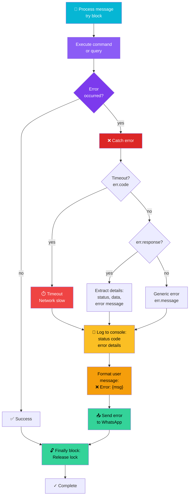

### 9.2 Validation Points

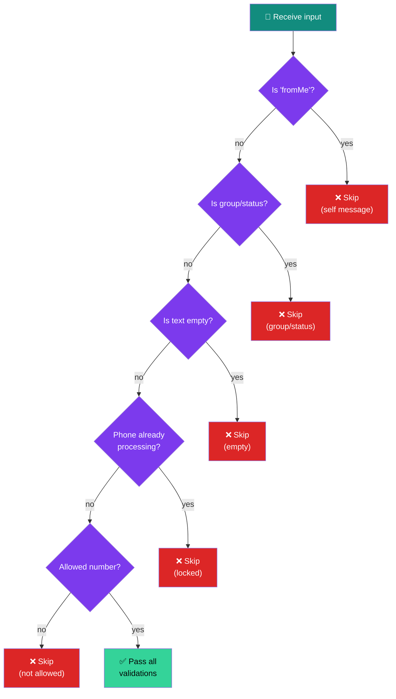

### 9.3 GitHub API Validation Errors

```javascript
validateToken(token) {
  // Returns: { valid: true, username: "..." }
  // Or: { valid: false, error: "..." }
  
  Errors handled:
  - 401: Invalid or expired token
  - 403: Token lacks required permissions
  - Network: Could not reach GitHub
}

validateRepo(owner, repo, token) {
  // Returns: { valid: true }
  // Or: { valid: false, error: "..." }
  
  Errors handled:
  - 404: Repo `owner/repo` not found
  - 401: Token is invalid
  - 403: Token does not have access
  - Network: Could not reach GitHub
}

validateAnthropicKeyFormat(key) {
  // Returns: boolean
  // Regex: /^sk-ant-[A-Za-z0-9\-_]{20,}$/
  
  Checks:
  - Starts with 'sk-ant-'
  - Followed by 20+ alphanumeric chars
  - No spaces or special chars
}
```

---

## 10. Lock Mechanism (Concurrency Control)

### 10.1 Per-Phone Processing Lock

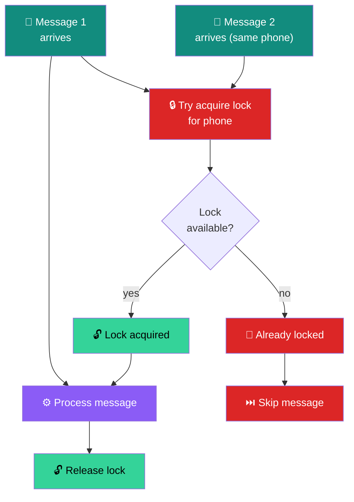

### 10.2 Why Lock is Needed

```
Problem:
message_create fires for EVERY message sent, including bot replies.
If bot sends a message, message_create re-triggers immediately.
This can cause:
- Infinite loops
- Double processing
- Race conditions

Solution:
Set<phone> tracks phones currently being processed.
When message arrives:
  - If phone in _processing: skip
  - Else: add to _processing, process, remove from _processing

Finally block ensures lock is ALWAYS released, 
even if error occurs during processing.
```

---

## 11. Project Change Detection

### 11.1 Natural Language Project Change Patterns

```javascript
Supported patterns:

1. Commands:
   !project owner/repo     // Direct command
   !project repo           // Repo only
   !owner name
   !repo name

2. Conversational:
   "switch to owner/repo"
   "change to owner/repo"
   "use owner/repo"
   "set repo to repo_name"
   "change repo to repo_name"
   "switch the project to owner/repo"
   "use the repository owner/repo"
   // + many more with optional filler words (the, my, a)

3. Validation:
   If repo specified and token exists:
     → GitHub API check before accepting
   If validation fails:
     → Show error, don't update project
   If success:
     → Update session, trigger graph build
```

### 11.2 Project Change Flow

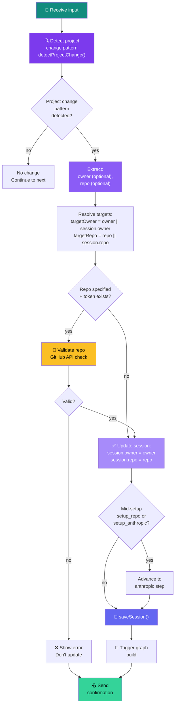

---

## 12. Initialization & Lifecycle

### 12.1 Startup Sequence

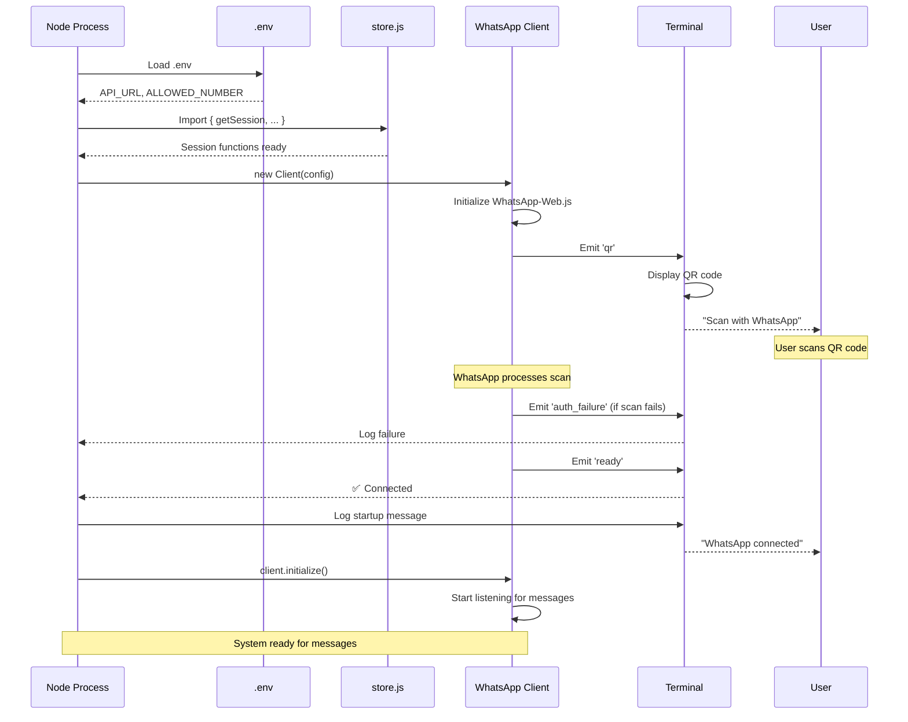

### 12.2 Client Configuration

```javascript
const client = new Client({
  authStrategy: new LocalAuth({ 
    dataPath: './.wwebjs_auth'    // Persist session across restarts
  }),
  puppeteer: {
    headless: true,               // No visible browser window
    args: [
      '--no-sandbox',             // Required for Linux/containers
      '--disable-setuid-sandbox'  // Security sandbox
    ],
  },
});

Events handled:
- 'qr'                → Display QR code for initial login
- 'ready'             → Client authenticated and ready
- 'auth_failure'      → Authentication failed
- 'disconnected'      → Lost connection to WhatsApp
- 'message_create'    → New message (both incoming + sent)
```

---

## 13. Environment Variables & Configuration

```bash
# .env file

# Backend API
API_URL=http://localhost:8000        # FastAPI server URL

# WhatsApp
ALLOWED_NUMBER=1234567890            # Only accept from this number
                                      # Leave blank to allow all

# Optional (for advanced features)
# WHATSAPP_PHONE_ID=...              # If using Meta Cloud API
# WHATSAPP_ACCESS_TOKEN=...          # If using Meta Cloud API
```

### 13.1 Session Persistence

WhatsApp authentication is cached in `./.wwebjs_auth/` directory:
- Contains browser profiles and session data
- Allows quick reconnection without re-scanning QR
- **Add to .gitignore** to avoid committing secrets

```bash
# .gitignore
.wwebjs_auth/
.env
sessions.json
logs/
```

---

## 14. Advanced Flows

### 14.1 Conversational Setup Flow with Follow-ups

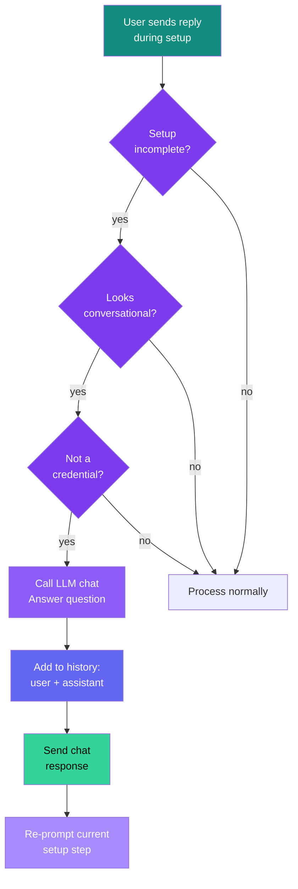

### 14.2 Graph Build Trigger

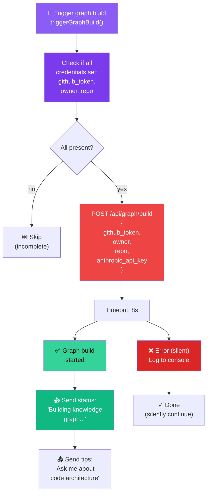

---

## 15. Technical Stack & Dependencies

```
whatsapp-bridge/
│
├── whatsapp-web.js        # WhatsApp client wrapper
│   └── Puppeteer          # Headless browser automation
│
├── axios                  # HTTP client for API calls
│   └── Timeout: 20-30s    # Request timeout handling
│
├── dotenv                 # Environment variable loader
│
└── qrcode-terminal        # QR code display in terminal
```

### 15.1 Tech Stack Summary

| Component | Technology | Purpose |
|-----------|-----------|---------|
| **WhatsApp Client** | whatsapp-web.js + Puppeteer | Connect to WhatsApp |
| **HTTP Client** | axios | Call backend API |
| **Config** | dotenv | Load environment variables |
| **Session** | JSON file (store.js) | Persist user state |
| **QR Display** | qrcode-terminal | Show QR in terminal |
| **Concurrency** | Set<phone> + try/finally | Thread-safe message processing |

---

## 16. Monitoring & Debugging

### 16.1 Console Logs

```
[startup] 🚀  Starting WhatsApp bridge...
[startup]     API → http://localhost:8000

[qr]      📱  Scan this QR code with WhatsApp:
[qr]      [QR code displayed in terminal]

[ready]   ✅  WhatsApp connected! Waiting for messages...

[message] 📞  Sender ID: 1234567890
[message] 📩  [1234567890] What PRs are open?

[request] 📤  [1234567890] replied (intent: status_query)

[error]   ❌  API error [500]: Could not reach GitHub
[error]   [error stack trace]

[graph]   [graph] build trigger failed: timeout
```

### 16.2 Debugging Checklist

```
If messages not being processed:
□ Is WhatsApp connected? (check for ✅ ready message)
□ Is the phone number in ALLOWED_NUMBER? (or blank to allow all)
□ Is the message non-empty?
□ Is the phone number correct? (check "Sender ID" log)
□ Is the backend API running? (check API_URL)

If setup fails:
□ Is GitHub token valid? (create at github.com/settings/tokens)
□ Is repo accessible by the token? (check repo visibility)
□ Is Anthropic key format correct? (starts with sk-ant-)

If API calls timeout:
□ Is backend server running? (check uvicorn logs)
□ Is network connectivity okay?
□ Is API_URL correct in .env?
□ Check backend error logs
```

---

## 17. Security Considerations

```
⚠️  Security Notes:

1. Credentials:
   - GitHub tokens + API keys should NOT be logged
   - Sessions stored locally (.wwebjs_auth, sessions.json)
   - Add both to .gitignore
   - Use environment variables, not hardcoded values

2. Phone Number Filtering:
   - ALLOWED_NUMBER prevents unauthorized users
   - Leave blank only in trusted environments
   - Always filter in production

3. Message Processing:
   - Lock mechanism prevents race conditions
   - Try/finally ensures cleanup even on errors
   - No persistent state in memory (all in store.js)

4. API Communication:
   - WhatsApp credentials never sent to backend
   - GitHub/Anthropic keys handled per-user in session
   - Timeouts prevent hanging requests (20-30s)

5. Per-User Sessions:
   - Each phone number has separate credentials
   - One phone cannot access another's tokens
   - Session isolation enforced
```

---

## 18. Quick Reference: Message Flow Summary

```
User sends WhatsApp message
         ↓
message_create event fired
         ↓
Validate (not self, not group, not empty)
         ↓
Acquire per-phone lock
         ↓
Load session from store
         ↓
Detect message type:
  ├─ Command (!setup, !status, etc.)         → Execute command
  ├─ Setup incomplete                        → Run setup step
  ├─ Project change request                  → Update project
  ├─ Anthropic key format                    → Save key
  └─ Natural language query (default)        → Call API
         ↓
If query:
  ├─ Add to history
  ├─ Call POST /api/chat/
  ├─ Format response
  ├─ Update history
  └─ Add cost/graph metadata
         ↓
Send WhatsApp reply
         ↓
Release lock
         ↓
Done ✓
```

---

**Document Version:** 1.0  
**Last Updated:** June 2026  
**Status:** Complete ✅
